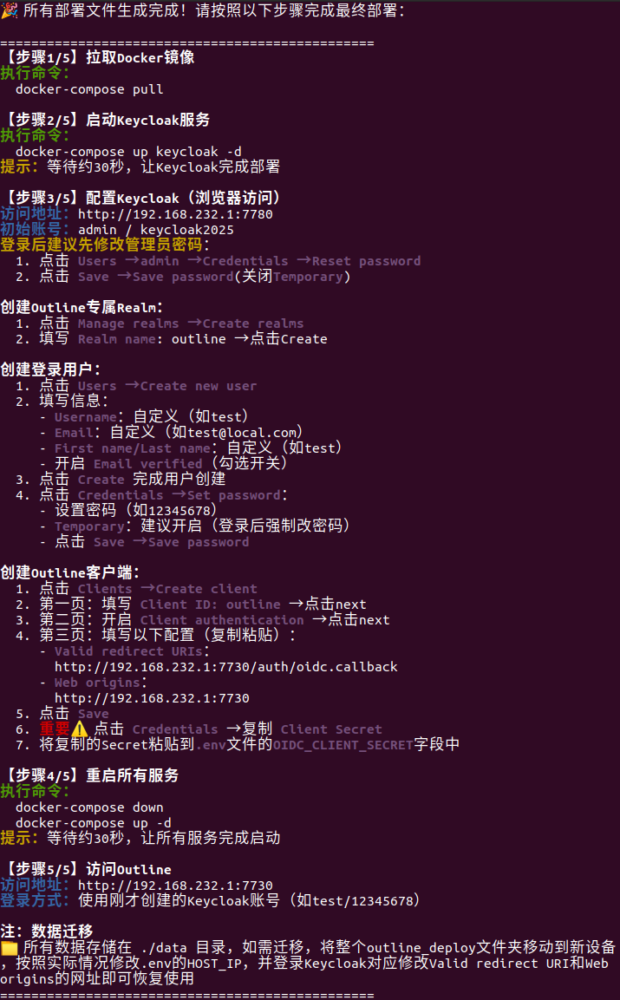

# 项目说明
本项目旨在使用docker尽量便捷地在本地/局域网部署Outline+Keycloak，主要的工作已集成至deploy_outline.sh脚本中，执行脚本并按照脚本提示即可完成安装工作，除去下载镜像的时间，整个部署流程不会超过十分钟。  
**当前版本使用的镜像(2025-12-05)**
1. outlinewiki/outline:1.1.0
2. quay.io/keycloak/keycloak:26.4.7
3. redis:7-alpine
4. postgres:16-alpine

可根据需要自行修改docker-compose.yml中使用的版本
# 使用方法
## 依赖项
1. docker
如果还未安装，可按照下方指令安装
```
sudo apt install apt-transport-https ca-certificates curl gnupg lsb-release
curl -fsSL https://mirrors.aliyun.com/docker-ce/linux/ubuntu/gpg | sudo gpg --dearmor -o /usr/share/keyrings/docker-archive-keyring.gpg
echo "deb [arch=amd64 signed-by=/usr/share/keyrings/docker-archive-keyring.gpg] https://mirrors.aliyun.com/docker-ce/linux/ubuntu $(lsb_release -cs) stable" | sudo tee /etc/apt/sources.list.d/docker.list > /dev/null
sudo apt update
sudo apt install docker-ce
sudo systemctl enable docker
sudo systemctl start docker
sudo groupadd docker
sudo usermod -aG docker $USER
```

2. docker-compose
本项目要求docker-compose版本>=2.1.0，如果未安装，可按照下方指令安装最新版
```
sudo curl -L \"https://github.com/docker/compose/releases/latest/download/docker-compose-\$(uname -s)-\$(uname -m)\" -o /usr/local/bin/docker-compose
sudo chmod +x /usr/local/bin/docker-compose
```
如果已经安装，可按照下方指令升级
```
# 1. 移除旧版本（根据安装情况选择）
sudo apt remove docker-compose
# 或
sudo rm /usr/local/bin/docker-compose
# 2. 安装最新版
curl -L \"https://github.com/docker/compose/releases/latest/download/docker-compose-\$(uname -s)-\$(uname -m)\" -o docker-compose
sudo mv docker-compose /usr/local/bin/
sudo chmod +x /usr/local/bin/docker-compose
# 3. 验证版本
docker-compose -v
``` 
3. docker镜像源配置，参考https://github.com/dongyubin/DockerHub
```
sudo mkdir -p /etc/docker
sudo tee /etc/docker/daemon.json <<EOF
{
  "registry-mirrors": [
    "https://docker.1panel.live",
    "https://docker.1ms.run",
    "https://dytt.online",
    "https://docker-0.unsee.tech",
    "https://lispy.org",
    "https://docker.xiaogenban1993.com",
    "https://666860.xyz",
    "https://hub.rat.dev",
    "https://docker.m.daocloud.io",
    "https://demo.52013120.xyz",
    "https://proxy.vvvv.ee",
    "https://registry.cyou"
  ]
}
EOF
sudo systemctl daemon-reload
sudo systemctl restart docker
```
## 部署
```
cd $HOME
mkdir outline && cd outline
git clone https://github.com/yqmy0814/outline_deploy
cd outline_deploy
bash deploy_outline.sh
```
按照脚本提示进行后续操作即可
<div align="center">
    
</div>

## 设置Outline管理员
Outline默认第一个登录的用户为管理员，这个用户可以用Outline的用户设置给其他用户设置权限，但如果第一个登录的用户被删除，可执行如下命令配置(假定用户邮箱为test@local.com)
```
cd $HOME/outline/outline_deploy
docker-compose exec postgres psql -U outline -d outline
UPDATE users SET role = 'admin' WHERE email = 'test@local.com';
\q
docker-compose restart outline-app
```